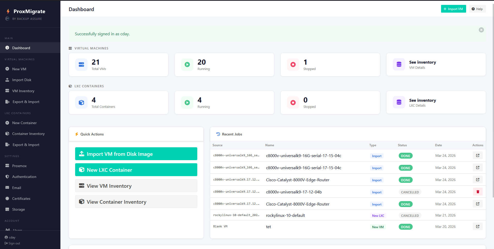
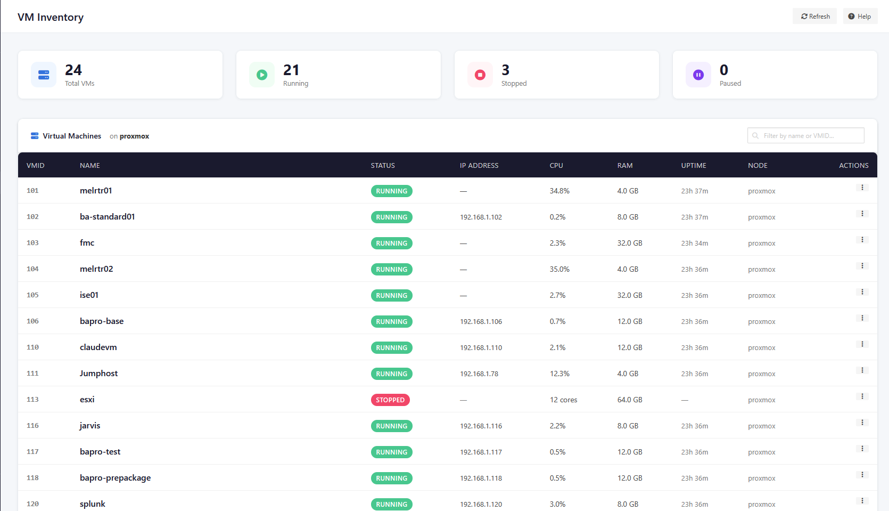
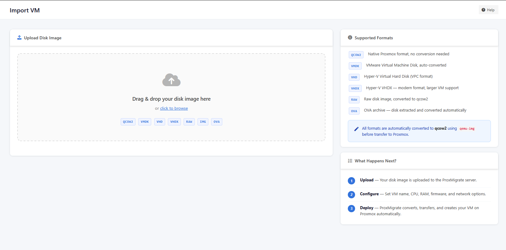
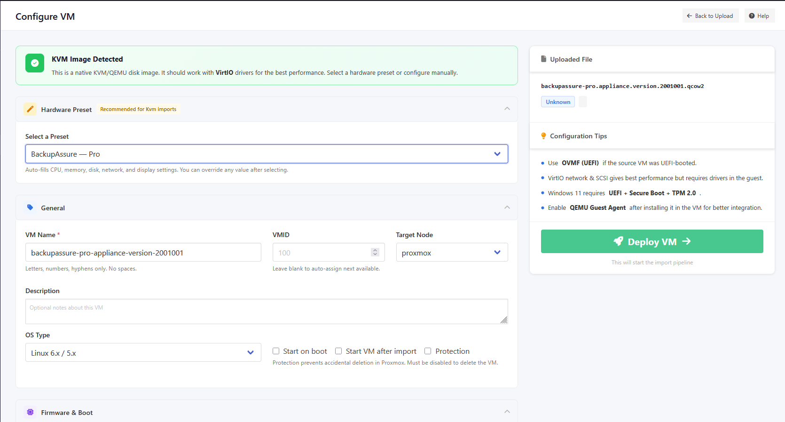
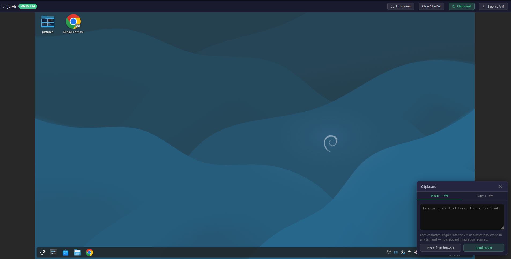
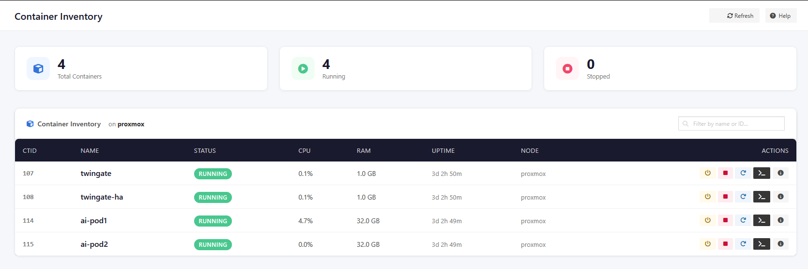
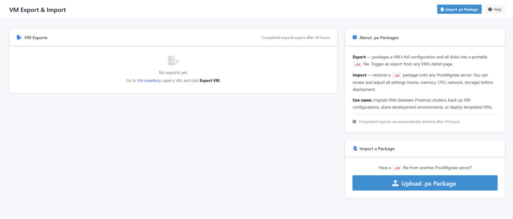
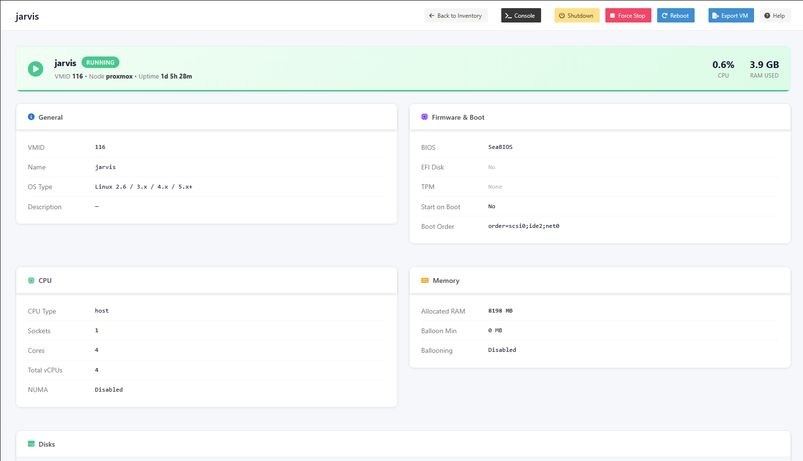
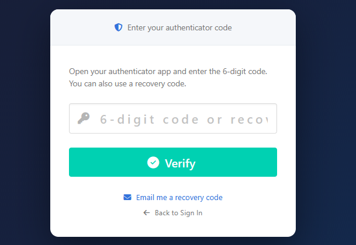
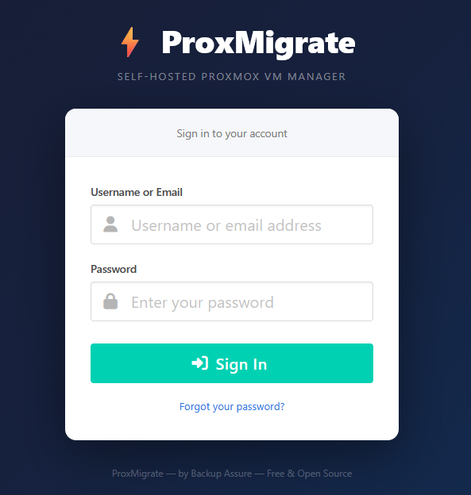

# ProxOrchestrator

**Version 1.1.2** — Build `2026-04-10.1`

> **To update an existing install:** `git pull origin main && sudo ./update.sh`

A free, open-source, self-hosted web UI for Proxmox VE — built for administrators who need to import disk images, create VMs, and manage their virtual infrastructure without logging into the Proxmox web interface.

Made by **[ForgedIO](https://github.com/ForgedIO)**.



---

## Features

- **Disk image import** — upload qcow2, vmdk, vhd, vhdx, raw, and OVA files; automatic conversion to qcow2 via `qemu-img`
- **VM creation wizard** — full configuration including EFI/UEFI, TPM 2.0, CPU type, network, storage, and boot order
- **ISO selection** — upload an ISO from your computer or browse and select ISOs already stored on Proxmox storage
- **VM inventory dashboard** — live status with kebab action menu: start/stop/shutdown/reboot, clone, export, and delete directly from the table
- **VM management** — full VM lifecycle from the detail page: delete, clone (full/linked), snapshots (take/rollback/delete with RAM capture), rename, and editable settings for CPU, memory, firmware/boot, and description
- **Disk management** — add disks (with SSD emulation, TRIM, IO thread, cache, backup options), resize, detach, re-attach with reconfigured options, delete unused disks, CD-ROM/ISO management (browse by storage pool, mount, eject, upload new ISOs with progress bar)
- **Network management** — connect/disconnect NICs per interface with inline toggle
- **VM console** — full in-browser VNC console with clipboard support (paste text into any OS including IOS-XE and Linux terminals)
- **LXC container management** — browse, start/stop/reboot, delete, clone, export, and view detailed config of existing LXC containers; create new containers from Proxmox templates with full network, storage, and credential configuration; kebab action menu matching VM inventory UX
- **LXC Community Scripts** — browse 460+ pre-built apps (Docker, Pi-hole, Home Assistant, Plex, Grafana, and more) and deploy them as LXC containers with one click using the community-scripts project; interactive WebSocket terminal for real-time deployment output
- **VM Community Scripts** — browse and deploy VM-based community scripts (Docker, Home Assistant OS, TrueNAS, Arch Linux, and more) with one click; fully interactive WebSocket terminal with whiptail prompt support; resilient screen sessions survive browser disconnect; automatic VMID detection with jump-to-console button; in-app catalog refresh from upstream GitHub
- **Setup wizard** — guided first-run setup for Proxmox API token, SSH key deployment, and environment discovery
- **Authentication** — local accounts, LDAP, and Microsoft Entra ID (Azure AD); login with username or email address
- **Password recovery** — self-service password reset via email (requires SMTP or Microsoft Graph API to be configured); local accounts only — LDAP/Entra ID users manage passwords in their directory
- **ACME certificate automation** — automated TLS certificates from Let's Encrypt or internal CAs (Smallstep, etc.); DNS-01 (Cloudflare, Route53, and more) and HTTP-01 challenge types; auto-renewal at half certificate validity
- **Dark mode** — system-wide dark theme with toggle in the header; CSS variable architecture for consistent styling across all pages
- **Self-signed or custom TLS** — runs HTTPS on port 8443 by default (configurable)

### VM Inventory


### Import Disk Images


### Hardware Presets & OVF Detection


### In-Browser VNC Console


### LXC Container Management


### VM Export & Import


### VM Detail


### Multi-Factor Authentication


### Authentication


## Requirements

- **Proxmox VE 7.x, 8.x, or 9.x** reachable on the network (tested on 9.x)
- **Python 3.10+** (installed automatically by `install.sh` — Ubuntu 22.04+, Debian 12+, Rocky 9+ all include a compatible version)
- Internet access on the host during install (for package downloads)
- **`install.sh` and `uninstall.sh` must be run as root** (via `sudo`)

### Supported operating systems

ProxOrchestrator is designed to run on a dedicated Linux server that connects to Proxmox over the network — not on the Proxmox host itself.

| Family | Tested distros |
|---|---|
| **Debian / Ubuntu** | Ubuntu 22.04 LTS, Ubuntu 24.04 LTS, Debian 11, Debian 12 |
| **RHEL / CentOS Stream / Rocky** | CentOS Stream 9 (EOL ~May 2027), CentOS Stream 10 (EOL ~2030), Rocky Linux 8/9, AlmaLinux 8/9, RHEL 8/9 |
| **SUSE / openSUSE** | openSUSE Leap 15, openSUSE Tumbleweed |

The installer auto-detects `apt`, `dnf`, `yum`, or `zypper` and installs the correct packages for your distribution. Ubuntu 22.04/24.04 and CentOS Stream 10 are the most tested and recommended for production use.

**SELinux note (RHEL/CentOS/Rocky):** The installer automatically detects SELinux and applies the required policy — `httpd_can_network_connect`, port labelling for the HTTPS port, and `restorecon` on the app directory. No manual SELinux configuration is needed.

#### A note on CentOS

> **"Isn't CentOS discontinued?"** — No, but the *old* CentOS Linux is. Here is what changed:
>
> **CentOS Linux** (the classic version) was a free, binary-compatible downstream clone of RHEL. Red Hat ended it early — CentOS Linux 8 reached end of life on **December 31, 2021**, several years ahead of schedule.
>
> **CentOS Stream** is a completely different product and is not discontinued. It is the official upstream development branch for the next RHEL minor release — meaning updates land in CentOS Stream first, then flow into RHEL. It is actively maintained by Red Hat and the CentOS Project and is a supported, production-grade platform:
> - CentOS Stream 9 — supported until approximately May 2027
> - CentOS Stream 10 — supported until approximately 2030, tied to the RHEL 10 Full Support lifecycle
>
> The ForgedIO team runs its own infrastructure on CentOS Stream specifically for the SELinux security model it provides. If someone tells you "CentOS is dead" they are thinking of the old CentOS Linux, not CentOS Stream.

### Why root/sudo is required

The installer performs operations that require root privileges:

- Creates a `proxorchestrator` system user and group
- Writes application files to `/opt/proxorchestrator/`
- Installs system packages (`apt-get install`, `dnf install`, etc.)
- Writes systemd unit files to `/etc/systemd/system/`
- Writes an nginx site configuration to `/etc/nginx/sites-available/` (or `/etc/nginx/conf.d/`)
- Writes a sudoers rule to `/etc/sudoers.d/proxorchestrator-nginx` so the `proxorchestrator` service user can reload nginx without a password (needed when TLS certificates or Proxmox connection settings change)
- Generates a self-signed TLS certificate

`uninstall.sh` also requires root to remove all of the above.

## Disk Space Requirements

ProxOrchestrator holds an uploaded disk image in two places before it reaches Proxmox:

1. **Upload temp dir** — Django writes the incoming file here during the HTTP upload. Defaults to the OS temp directory (`/tmp` on Linux), which is often a RAM-backed `tmpfs` mount limited to 50% of total RAM. A 15 GB image will fail if this fills up.
2. **Upload store** (`/opt/proxorchestrator/uploads/`) — the file is copied here once the upload completes, then deleted after it has been transferred to Proxmox via SFTP.

**Rule of thumb:** the ProxOrchestrator server needs free space equal to at least **2× the size of the largest image** you plan to import (temp file + stored file exist briefly at the same time).

### Changing the upload temp directory

If your `/tmp` is small (check with `df -h /tmp`), set `UPLOAD_TEMP_DIR` in `/opt/proxorchestrator/.env` to a path on a disk with enough free space:

```env
UPLOAD_TEMP_DIR=/data/proxorchestrator/tmp
```

Create the directory and give the `proxorchestrator` user write access, then restart the service:

```bash
sudo mkdir -p /data/proxorchestrator/tmp
sudo chown proxorchestrator:proxorchestrator /data/proxorchestrator/tmp
sudo systemctl restart proxorchestrator-gunicorn
```

## Quick Install

```bash
git clone https://github.com/ForgedIO/ProxOrchestrator.git
cd ProxOrchestrator
sudo ./install.sh
```

To use a custom HTTPS port:

```bash
sudo ./install.sh --port 9443
```

The installer:
1. Creates a dedicated `proxorchestrator` system user
2. Installs Python, Redis, nginx, and `qemu-utils`
3. Sets up a Python virtualenv and installs all dependencies
4. Generates a self-signed TLS certificate (replace with your own at `/opt/proxorchestrator/certs/`)
5. Configures nginx as a reverse proxy with WebSocket support
6. Creates and enables systemd services for gunicorn and Celery (auto-start on reboot)
7. Runs database migrations and creates an admin account

After install, open `https://<your-server-ip>:8443` and log in with the admin account created during installation.

## Updating

To update an existing installation to the latest version:

```bash
cd /path/to/ProxOrchestrator   # wherever you cloned the repo
git pull origin main
sudo ./update.sh
```

`update.sh` will:
1. Rsync all application files into `/opt/proxorchestrator/`
2. Install any new Python dependencies
3. Run database migrations
4. Collect static files
5. Restart gunicorn and Celery

It does **not** touch your nginx config, TLS certificates, systemd unit files, or SSH keys. Your data and configuration are preserved.

## First Login

The installer prompts you to create an admin account. If you pressed Enter to skip the password prompt, the defaults are:

| Field | Value |
|---|---|
| Username | `admin` (or whatever you entered) |
| Password | `Password!` |

You will be **forced to change the password on first login** before you can access anything else. There is no security risk in the default password being known because it cannot be used without immediately setting a new one.

After changing your password you are taken directly into the **Setup Wizard** to connect ProxOrchestrator to your Proxmox host.

## First-Run Wizard

The wizard walks through:

1. **Proxmox connection** — hostname/IP, API port
2. **API token** — create a token in Proxmox (`Datacenter → Permissions → API Tokens`) with `VM.Allocate`, `VM.Console`, `Datastore.AllocateSpace`, and `Sys.Audit` privileges
3. **SSH key** — ProxOrchestrator generates a key pair and copies the public key to Proxmox for `qm importdisk` operations
4. **Environment discovery** — nodes, storage pools, networks, and existing VMIDs
5. **Defaults** — default node, storage, bridge, CPU, memory, VMID range, and VirtIO Windows Drivers ISO

## Windows VMs and VirtIO Drivers

Windows requires VirtIO drivers to use Proxmox's paravirtual SCSI controller and network adapter at full performance. ProxOrchestrator has built-in support for automatically attaching the driver disc to any Windows VM.

### Setting up the VirtIO ISO

1. Download the latest `virtio-win-*.iso` from the **[Fedora virtio-win archive](https://fedorapeople.org/groups/virt/virtio-win/direct-downloads/archive-virtio/?C=M;O=D)** (sorted newest first).
2. Upload it to an ISO-capable storage pool on your Proxmox host (e.g. `data`).
3. In ProxOrchestrator go to **Proxmox Settings → VM Defaults** and click **Scan** next to the VirtIO Windows Drivers ISO field. It will auto-detect the ISO and fill in the storage reference (e.g. `data:iso/virtio-win-0.1.285.iso`). Save.

### How it works

Once configured, any time you create or import a Windows VM (OS type = win*), the configure form shows an **"Attach VirtIO Windows Drivers ISO as second CD-ROM"** checkbox (pre-checked). When ticked:

- **New VM from ISO** — the driver disc is attached as `ide3`; the Windows install ISO stays on `ide2`. After Windows installs, open the driver disc in Explorer and run the relevant installers.
- **Imported disk image** — the driver disc is attached as `ide2`. Boot the VM and install drivers from the Proxmox console.

When a new VirtIO ISO version is released, upload the new ISO to Proxmox, update the path in **Proxmox Settings → VM Defaults**, and all subsequent Windows VMs will use it. No code change needed.

## Known Gotchas

### Importing a disk image

**Disk is attached and set as the boot device automatically.**
ProxOrchestrator parses the output of `qm importdisk` to get the real disk reference (which varies by storage backend — directory, LVM, ZFS, Ceph) and then runs `qm set --<bus>0 <ref> --boot order=<bus>0` to attach it and mark it bootable. You should not need to do anything manually in Proxmox after a successful import.

**SeaBIOS vs OVMF (UEFI) — choose the right firmware for your source VM.**
- **SeaBIOS** (legacy BIOS): boots from the MBR. Use this for older Linux/Windows images and for any image that was originally on a BIOS machine.
- **OVMF** (UEFI): scans for an EFI System Partition (ESP) on first boot. Use this for images from UEFI machines (most Windows 10/11, modern Linux). On first boot OVMF auto-discovers the bootloader from the ESP and writes it into the EFI disk (NVRAM). Subsequent boots use the stored entry.
- **Wrong firmware = no boot.** If you pick OVMF for a BIOS-only disk (MBR, no ESP) the VM will drop to the UEFI shell. Switch it back to SeaBIOS in Proxmox (VM → Options → BIOS).

**Imported disk has no EFI partition (OVMF + no ESP).**
Some older images that were running under UEFI still only have a BIOS boot partition and rely on legacy CSM. If the import boots to the UEFI shell, select SeaBIOS instead.

**Add EFI Disk when selecting OVMF.**
The EFI disk stores NVRAM boot entries between reboots. Without it, OVMF re-scans every boot (slower, and boot entries set inside the guest OS are lost on reboot). Always tick "Add EFI Disk" when selecting OVMF.

**Windows 11 requires OVMF + Secure Boot + TPM 2.0.**
Tick all three options in the Firmware & Boot section. The "Enroll Secure Boot Keys" option pre-loads the Microsoft keys so Windows 11 passes Secure Boot validation without needing to enroll them manually in the UEFI shell.

**VirtIO drivers are not included in Windows images.**
If you import a Windows disk image and the VM boots but has no network or the disk is very slow, the VirtIO drivers are missing. See the [Windows VMs and VirtIO Drivers](#windows-vms-and-virtio-drivers) section above — ProxOrchestrator can attach the driver disc automatically. Alternatively, download the ISO from the [Fedora virtio-win archive](https://fedorapeople.org/groups/virt/virtio-win/direct-downloads/archive-virtio/?C=M;O=D) and attach it manually in Proxmox.

**OVA files — single-disk only.**
OVA import extracts the first VMDK found inside the archive. Multi-disk OVAs (multiple `.vmdk` files) will only import the first disk. Attach additional disks manually in Proxmox after import.

### Creating a new VM from ISO

**Two ways to select an ISO.**
When creating a VM, the ISO step has two sub-options:
- **Upload from computer** — select a local `.iso` file and ProxOrchestrator uploads it to Proxmox ISO storage before creating the VM.
- **Browse Proxmox** — select a storage pool and pick from ISOs already stored there. No upload step; the VM is created and the ISO attached directly.

**ISO storage must have the `iso` content type enabled.**
In Proxmox go to Datacenter → Storage → select the pool → Edit → Content, and ensure `ISO Image` is ticked. Pools without this content type will not appear in the ISO storage dropdowns.

**Boot order — no manual changes needed after install.**
ProxOrchestrator sets the boot order to `disk first, CD-ROM second`. On the first boot the disk is blank so the firmware falls through to the ISO and the installer runs. Once the OS is installed the disk becomes bootable and takes priority automatically — the VM boots from disk on every subsequent start without any manual change. If you ever need to reinstall, move the CD-ROM above the disk in Proxmox (VM → Options → Boot Order).

**VirtIO disk and network drivers during Windows installation.**
The Windows installer does not include VirtIO drivers. ProxOrchestrator detects when a Windows OS type is selected and automatically uses **SATA** as the disk bus so the installer can see the disk. If the VirtIO ISO is configured (see [Windows VMs and VirtIO Drivers](#windows-vms-and-virtio-drivers)), ProxOrchestrator attaches it automatically as a second CD-ROM — open it from inside the installer or after first boot to install the drivers. Download the latest ISO from the [Fedora virtio-win archive](https://fedorapeople.org/groups/virt/virtio-win/direct-downloads/archive-virtio/?C=M;O=D).

## TLS Certificate Management

ProxOrchestrator includes a full certificate management UI at **Settings → Certificates**. Four workflows are supported:

### Option 1 — Generate a CSR (recommended for CA-signed certs)

1. Go to **Settings → Certificates → Generate CSR**.
2. Fill in the Common Name (e.g. `proxorchestrator.example.com`), optional Organization and Country, and any DNS or IP Subject Alternative Names.
3. Click **Generate CSR** — ProxOrchestrator creates an RSA 2048 private key (stored on the server) and a CSR.
4. Copy the CSR from the **Pending CSR** panel and submit it to your Certificate Authority.
5. Once your CA returns the signed certificate, go to **Upload Signed Cert** and upload it. ProxOrchestrator verifies the cert matches the stored key before installing.

### Option 2 — Upload a certificate and private key

If you already have a cert/key pair, go to **Settings → Certificates → Upload Cert + Key** and upload both files (PEM format, unencrypted private key).

### Option 3 — ACME automation (Let's Encrypt or internal CA)

Go to **Settings → Certificates → ACME** and configure your ACME provider. Supports:
- **Let's Encrypt** — automatic public certificates via DNS-01 or HTTP-01 challenge
- **Internal CAs** — Smallstep, EJBCA, or any ACME-compatible CA with custom directory URL and optional CA bundle
- **DNS-01 providers** — Cloudflare, Route53, and others with API key integration for fully automatic renewal
- **Auto-renewal** — certificates renew automatically at half their validity period

### Option 4 — Generate a self-signed certificate

Go to **Settings → Certificates → Self-Signed** and click **Generate New Self-Signed Certificate**. This creates a 10-year self-signed cert. Browsers will show a security warning.

### Replacing manually

You can also place files directly and reload nginx:

```
/opt/proxorchestrator/certs/proxorchestrator.crt
/opt/proxorchestrator/certs/proxorchestrator.key
```

```bash
sudo nginx -s reload
```

### Changing the HTTPS port

The default port is `8443`. To change it after install, go to **Settings → Certificates** and use the **HTTPS Port** card. ProxOrchestrator will update the nginx configuration, validate it, and redirect your browser to the new port automatically.

## Services

ProxOrchestrator runs as five systemd services, all enabled for auto-start on reboot:

| Service | Purpose |
|---|---|
| `proxorchestrator-gunicorn` | Django application server |
| `proxorchestrator-celery` | Background task worker (conversions, imports) |
| `proxorchestrator-daphne` | ASGI server for WebSocket connections (community scripts terminal) |
| `nginx` | HTTPS reverse proxy and WebSocket proxy |
| `redis-server` | Task queue broker |

```bash
# Check status
sudo systemctl status proxorchestrator-gunicorn proxorchestrator-celery

# View logs
sudo journalctl -u proxorchestrator-gunicorn -f
sudo journalctl -u proxorchestrator-celery -f
```

## Uninstall

```bash
sudo ./uninstall.sh
```

This removes all services, files, and the `proxorchestrator` system user. The database and uploads under `/opt/proxorchestrator/` are removed — back up anything you need first.

## LXC Container Management

ProxOrchestrator includes a full LXC container management interface alongside VM management.

### Inventory

The LXC inventory page lists all containers on your Proxmox node with live CPU, memory, and uptime stats. Containers are sorted with running ones first. You can start, stop, shutdown, or reboot any container directly from the list — actions update in real time via HTMX polling without a page refresh.

### Container Detail

Click any container to see its full configuration: hostname, OS type, CPU and memory allocation, rootfs and mount points, network interfaces, DNS settings, and enabled features (nesting, FUSE, etc.).

### In-Browser Console

Each container has a full noVNC console accessible directly from ProxOrchestrator — the same in-browser console experience as VMs.

### Creating Containers

The container creation wizard is a two-step flow:

1. **Choose a template** — browse templates already downloaded to a storage pool, or select from the full list of available templates to download automatically before creation
2. **Configure** — set hostname, CPU, memory, swap, rootfs storage and size, network (DHCP or static IP), DNS, root password, SSH public key, and options like nesting (for Docker-in-LXC) and unprivileged mode

ProxOrchestrator handles template downloading, container creation, and optional auto-start — all tracked with a live progress view.

---

## Changelog

### v1.1.2 — 2026-04-10.1
- **LXC settings editors** — pencil-edit modals on the container detail page for CPU (cores, cpulimit, cpuunits), memory (RAM, swap), and description; running-container restart warnings where relevant
- **LXC options editor** — edit start-on-boot, protection, startup order, features (Nesting, FUSE, keyctl, mknod), tags, and hookscript from a dedicated modal; unprivileged shown read-only with a note explaining it can only be changed by container recreation
- **LXC mountpoint management** — HTMX-loaded storage card with add (storage pool, size, mount path, backup flag), grow-only resize modal, and detach for mp0+ (rootfs is resize-only); mirrors VM disk UX
- **LXC NIC connect/disconnect** — toggle `link_down` per interface from the container detail page; disconnected NICs render dimmed with status indicator

### v1.1.2 — 2026-04-08.2
- **VM Community Scripts marketplace** — browse and deploy VM-based community scripts (Docker, Home Assistant OS, TrueNAS, Arch Linux, OpenWrt, OPNsense, and more) with one click from a searchable, categorized catalog; fully interactive WebSocket terminal with whiptail prompt support; resilient screen sessions survive browser disconnect and allow reattach; automatic VMID detection with jump-to-Proxmox-console button; in-app catalog refresh from upstream GitHub via Celery task; VM community script jobs shown on dashboard

### v1.1.2 — 2026-04-08.1
- **LXC Community Scripts marketplace** — browse 460+ pre-built apps (Docker, Pi-hole, Home Assistant, Plex, Grafana, etc.) and deploy as LXC containers with one click; interactive WebSocket terminal for real-time deployment output; categorized browsing with search; catalog auto-update from community-scripts project
- **ACME certificate automation** — automated TLS certificates from Let's Encrypt or internal CAs (Smallstep, etc.); DNS-01 challenge with DNS provider API integration (Cloudflare, Route53, and more); HTTP-01 challenge support; auto-renewal at half certificate validity; real-time issuance progress with HTMX polling; IP SAN support for internal CA certs
- **Dark mode** — system-wide dark theme with CSS variable architecture; toggle in header with persistence; Bulma component overrides for tags, buttons, tabs, file inputs, and code blocks; attribute selectors catch hardcoded inline colors across all templates
- **LXC kebab menu** — container inventory table now uses state-aware three-dot dropdown menu matching VM inventory UX; includes start/stop/shutdown/reboot, clone, export, delete, and details actions
- **LXC container delete** — type-to-confirm CTID modal with async task polling, spinner, and auto-retry on storage errors; mirrored from VM delete UX
- **Kebab menu overflow fix** — dropdown menus use fixed positioning to escape table overflow containers; auto-expand upward when near viewport bottom; close on scroll
- **Certificate UX** — independent upload/paste PEM toggles for certificate and private key fields; paste PEM text directly instead of requiring file upload
- **Dark mode fixes** — dashboard job text, email delivery method selection, SSH public key display, Save Token button, code/pre elements, Bulma light-variant components all visible in dark mode

### v1.1.2 — 2026-03-29.1
- **VM delete** — type-to-confirm VMID modal, async task polling with spinner, auto-retry on storage errors (e.g. missing logical volumes)
- **VM clone** — full or linked clone with storage pool selection, VMID validation, real-time progress page polling Proxmox task status
- **VM snapshots** — take (with optional RAM state capture), rollback, and delete snapshots from the VM detail page with HTMX live updates
- **VM rename** — inline pencil-icon edit on the General card
- **Disk management** — add disks with full options (storage pool, size, bus type, cache mode, SSD emulation, TRIM/discard, IO thread, backup), resize existing disks, detach disks (keeps volume on storage), re-attach unused disks with reconfigurable options, permanently delete unused disks
- **CD-ROM/ISO management** — browse ISOs by storage pool, mount/eject/change ISOs, remove CD-ROM drives, upload new ISOs to Proxmox via SFTP with progress bar, auto-mount after upload option
- **NIC connect/disconnect** — toggle network interface link state per NIC with inline HTMX update; disconnected NICs shown dimmed with status indicator
- **VM settings editors** — editable CPU (type, sockets, cores, NUMA), memory (GB input with decimal support, ballooning toggle), firmware/boot (BIOS/UEFI with EFI disk + TPM options, visual boot order builder, start on boot), and description; running VM changes show restart-required warning
- **Kebab action menu** — VM inventory table actions replaced with state-aware three-dot dropdown menu with icons and labels; Export VM now accessible directly from inventory for both running and stopped VMs
- **Stuck VM detection** — inventory and detail page detect VMs not responding to stop/shutdown commands after ~60s and show "Not Responding" warning with guidance to investigate in Proxmox console
- **Auto-reload on status change** — VM detail page automatically reloads when VM status changes externally (stopped from inventory, Proxmox, etc.) so action buttons update without manual refresh
- **Close Console button** — red X button in console toolbar to close the tab
- **RAM Used fix** — detail page status banner now shows RAM usage consistently during polling

### v1.1.2 — 2026-03-24.3
- **LXC one-liner installer** — deploy ProxOrchestrator on Proxmox with a single command; auto-detects storage, configurable via flags (ID, hostname, IP, storage, disk, RAM, cores, port)

### v1.1.2 — 2026-03-24.2
- **ISO boot detection** — OVA files containing ISO boot images (e.g. Cisco 8000v) are detected, ISO uploaded to user-selected Proxmox storage, attached as CD-ROM with boot order set to CD-ROM first
- **Cisco 8000v preset** — Catalyst 8000V / CSR 1000v hardware preset (SeaBIOS, i440fx, VirtIO, serial port)
- **Console button fix** — detail page now reloads after start/stop so Console and action buttons update correctly
- **TOTP MFA** — authenticator app (Google Authenticator, Authy) for local and LDAP accounts, admin enforcement toggle, recovery codes, email bypass, per-user MFA status in user management
- **Password recovery** — self-service password reset via email link for local accounts; email login support
- **LDAP attribute sync** — email, first name, last name synced from LDAP on login
- **Venv permissions fix** — install.sh and update.sh auto-fix venv ownership

### v1.1.2 — 2026-03-24.1
- **Hardware presets** — categorized preset dropdown (Server OS, Appliances, Other) auto-fills CPU, memory, disk bus, NIC, and BIOS settings for common platforms including Cisco, Aruba, Palo Alto, Fortinet, Sophos, and BackupAssure appliances
- **OVF parser** — OVA uploads auto-detect hardware from the OVF descriptor (CPU, memory, firmware/EFI, disk controller, NIC type, OS type, multi-disk layout)
- **Multi-disk OVA import** — OVA files with multiple VMDKs are properly extracted and all disks imported automatically
- **Platform detection** — VMware (.ova/.vmdk), Hyper-V (.vhd/.vhdx), and KVM (.qcow2/.raw/.img) uploads show colour-coded guidance banners
- **VM name sanitisation** — filenames with underscores, dots, and spaces are auto-converted to valid Proxmox DNS hostnames
- **Console button in inventory rows** — launch noVNC console directly from the VM and LXC inventory tables for running instances
- **Upload error UX** — client-side file extension validation with prominent error banner; extra disk upload now checks HTTP status to prevent corrupted form entries
- **Row disappear fix** — VM/container rows no longer vanish during stop/shutdown actions (fixed HTMX `hx-select` inheritance and missing `django.contrib.humanize`)
- **Console disconnect fix** — nginx WebSocket proxy config regenerated on Gunicorn startup so consoles survive server reboots
- **Serial port option** — new checkbox on import configure page, enabled by default for Cisco appliance presets
- **LXC clone and snapshots** — clone containers, manage snapshots from the detail page
- **LXC export/import** — export containers as .px packages, import on another Proxmox node
- **Job cancellation** — cancel queued or in-progress import and VM create jobs
- **Inventory sort** — tables sorted by VMID only for stable row positions during state transitions
- **Git workflow cheat sheet** — team reference for feature/bugfix/hotfix branch workflows

### v1.1.2 — 2026-03-20.1
- **LXC container management** — inventory, detail view, start/stop/shutdown/reboot actions, in-browser console
- **LXC container creation** — two-step wizard with template browser (download on demand), full network/storage/credential configuration, live progress tracking
- **CPU type default changed to `host`** — better default for VM imports and new VM creation; avoids boot failures on guests compiled for newer CPU feature sets

### v1.1.2 — 2026-03-19.2
- **Email Settings** — SMTP and Microsoft Graph API (client credentials / Mail.Send) for outgoing email
- Encrypted storage of SMTP password and Graph client secret
- Live test send from the settings page for both backends
- Full Azure App Registration setup guide built into the UI
- "Enable email delivery" checkbox on Save — one action saves and activates

### v1.1.2 — 2026-03-19.1
- **VM Export** — export any VM as a portable `.px` package (compressed qcow2 + JSON manifest)
- **Smart export modes** — live, filesystem freeze (QEMU guest agent), or graceful shutdown; Windows VMs default to shutdown for NTFS/registry consistency
- **VM Import from .px** — upload a `.px` package, review and modify configuration pre-populated from the manifest, then deploy
- **Automatic cleanup** — export packages are purged from the server after 24 hours
- **Proxmox temp file safety** — remote temp files are always cleaned up after disk transfer, even on failure

### v1.1.1 — Phase 1 baseline
- Disk image import — qcow2, vmdk, vhd, vhdx, raw, OVA with automatic format conversion
- VM creation wizard — full hardware configuration including EFI/UEFI, TPM 2.0, Secure Boot
- VM inventory dashboard — live status, start/stop/shutdown/reboot with real-time updates
- In-browser VNC console with clipboard support
- First-run setup wizard — Proxmox API token, SSH key, environment discovery
- Authentication — local accounts, LDAP, Microsoft Entra ID (Azure AD)
- TLS certificate management — CSR workflow, upload, self-signed, port configuration
- VirtIO Windows driver ISO support

---

## Roadmap

### Phase 1 — Core VM Management (complete)
- [x] Disk image import — qcow2, vmdk, vhd, vhdx, raw, OVA with automatic format conversion
- [x] New VM creation wizard — ISO install (upload or browse Proxmox storage) or blank disk, full hardware configuration
- [x] VM inventory dashboard — live status, start/stop/shutdown/reboot
- [x] In-browser VNC console with clipboard support
- [x] First-run setup wizard — Proxmox API token, SSH key, environment discovery, defaults
- [x] Authentication — local accounts, LDAP, Microsoft Entra ID (Azure AD) with group-based access control
- [x] TLS certificate management — CSR workflow, upload, self-signed, port configuration
- [x] VirtIO Windows driver ISO browser — automatically attach drivers to Windows VMs
- [x] Email delivery — SMTP and Microsoft Graph API, with live test send and encrypted credential storage
- [x] LXC container management — inventory, detail, console, start/stop/reboot, creation wizard
- [x] Password recovery — self-service password reset for local accounts via email, login with email address
- [x] MFA — TOTP (authenticator app) for local and LDAP accounts, recovery codes, email bypass, admin enforcement
- [x] ACME certificate automation — Let's Encrypt and internal CAs, DNS-01/HTTP-01 challenges, auto-renewal
- [x] Dark mode — system-wide theme toggle with CSS variable architecture
- [x] VM Community Scripts — browse and deploy VM-based community scripts with interactive terminal and catalog refresh

### Phase 2 — VM Export & Portable Packages
Export a complete VM (configuration + all disks) as a `.px` package — a tar.gz archive with a JSON manifest — that can be imported on any ProxOrchestrator server to recreate the VM identically.

- [x] VM export: capture `qm config`, export all disks via `qemu-img convert -c` (compressed qcow2), bundle into `.px` archive with JSON manifest
- [x] Smart export modes: live (crash-consistent), freeze (filesystem freeze via QEMU guest agent), shutdown (graceful stop → export → optional restart)
- [x] Package import: parse manifest, transfer disks to Proxmox, recreate VM configuration pre-populated from manifest, re-attach disks
- [x] `.px` packages are standard tar.gz archives — rename to `.tar.gz` to inspect contents
- [x] Automatic cleanup of export packages after 24 hours

### Distribution — LXC One-Liner Installer
Deploy ProxOrchestrator as a Proxmox LXC container with a single command — no manual setup required. Run this on your **Proxmox VE host** (not inside a VM or container):

```bash
bash -c "$(wget -qLO - https://github.com/ForgedIO/ProxOrchestrator/raw/main/lxc-install.sh)"
```

With options (use `--` to pass flags to the script):

```bash
bash -c "$(wget -qLO - https://github.com/ForgedIO/ProxOrchestrator/raw/main/lxc-install.sh)" -- --storage nvme-pool2 --id 200 --ip 192.168.1.50/24 --gateway 192.168.1.1
```

| Option | Default | Description |
|---|---|---|
| `--id <n>` | Next available | Container ID (VMID) |
| `--hostname <s>` | `proxorchestrator` | Container hostname |
| `--storage <s>` | Auto-detect | Proxmox storage for rootfs (e.g. `local`, `local-lvm`, `nvme-pool2`) |
| `--bridge <s>` | `vmbr0` | Network bridge |
| `--disk <n>` | `16` | Rootfs size in GB |
| `--ram <n>` | `2048` | RAM in MB |
| `--cores <n>` | `2` | CPU cores |
| `--port <n>` | `8443` | ProxOrchestrator web UI port |
| `--ip <cidr>` | DHCP | Static IP with subnet (e.g. `192.168.1.50/24`) |
| `--gateway <ip>` | — | Default gateway (required with `--ip`) |
| `--dns <servers>` | Host DNS | DNS servers (e.g. `"192.168.1.78 8.8.8.8"`) |

- [x] `lxc-install.sh` — creates a Debian 12 LXC container on the Proxmox host with sensible defaults, then runs `install.sh` inside it automatically
- [x] Follows the [tteck/Proxmox helper scripts](https://github.com/community-scripts/ProxmoxVE) pattern — the primary distribution mechanism for non-technical Proxmox users
- [x] Storage auto-detection — tries `local-lvm`, then `local`, then first active storage
- [x] No code changes required — `install.sh` already works inside LXC

#### Managing the LXC container

**Find your container ID:**
```bash
pct list | grep proxorchestrator
```

**Enter the container** (no password needed — run from the Proxmox host shell or SSH):
```bash
pct enter <container-id>
```

**Update ProxOrchestrator to the latest version** (run from inside the container):
```bash
cd /opt/proxorchestrator-src && git pull origin main && sudo ./update.sh
```

Or as a one-liner from the Proxmox host without entering the container:
```bash
pct exec <container-id> -- bash -c "cd /opt/proxorchestrator-src && git pull origin main && sudo ./update.sh"
```

**Restart services** (from inside the container):
```bash
sudo systemctl restart proxorchestrator-gunicorn proxorchestrator-celery
```

### VM Management (complete)
- [x] VM delete — type-to-confirm, async task polling, auto-retry on storage errors
- [x] VM clone — full/linked clone with storage selection and progress tracking
- [x] VM snapshots — take (with RAM capture), rollback, and delete
- [x] VM rename — inline edit from detail page
- [x] Disk management — add, resize, detach, attach, delete disks; full options (SSD, TRIM, IO thread, cache)
- [x] CD-ROM/ISO — browse, mount, eject, upload with progress bar and auto-mount
- [x] NIC connect/disconnect — toggle link state per interface
- [x] VM settings — editable CPU, memory, firmware/boot, description
- [x] Kebab menu — state-aware dropdown with Export VM in inventory table
- [x] Stuck VM detection — "Not Responding" warning after timeout

### Community Scripts (complete)
- [x] Community Scripts marketplace — browse 460+ pre-built apps and deploy as LXC containers
- [x] Interactive WebSocket terminal for real-time deployment output
- [x] Categorized browsing with search and catalog auto-update

### LXC Management Enhancements (complete)
- [x] LXC kebab menu — state-aware dropdown with clone, export, delete in container inventory table
- [x] LXC container delete — type-to-confirm CTID modal with async task polling
- [x] LXC settings editors — CPU (cores, limit, units), memory (RAM, swap), and description editable from the detail page
- [x] LXC mountpoint management — add, resize, and detach mountpoints from the container detail page
- [x] LXC NIC management — connect/disconnect network interfaces with link state toggle

### Phase 3 — Proxmox Monitoring & Alerting
Turn ProxOrchestrator into a comprehensive Proxmox observability platform.

- [ ] Cluster-wide dashboard — node CPU, RAM, storage, network I/O at a glance
- [ ] Historical metrics collection and graphing (RRD or time-series store)
- [ ] Alerting — threshold-based alerts (CPU, memory, disk) with email and webhook (Slack/Teams) delivery
- [ ] Multi-cluster support

---

## Architecture

- **Backend:** Django 4.2 + Gunicorn (HTTP) + Daphne (WebSocket/ASGI)
- **Task queue:** Celery + Redis
- **Proxmox integration:** REST API (port 8006) for all reads and VM actions; SSH/SFTP via `paramiko` for disk transfers and `qm importdisk`
- **Frontend:** Django templates + HTMX + xterm.js (no JavaScript framework required)
- **Proxy:** nginx handles TLS termination and WebSocket proxying for consoles and community script terminals
- **Database:** SQLite (self-contained, no separate database server needed)

## License

MIT License — see [LICENSE](LICENSE) for details.
